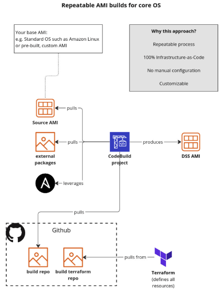

<!-- markdownlint-disable -->
# Dataiku Terraform Deployment on AWS

<!-- markdownlint-restore -->

[![README Header][readme_header_img]][readme_header_link]

<!--

  ** DO NOT EDIT THIS FILE
  **
  ** This file was automatically generated by the `build-harness`.
  ** 1) Make all changes to `README.yaml`
  ** 2) Run `make init` (you only need to do this once)
  ** 3) Run`make readme` to rebuild this file.
  **
  ** (We maintain HUNDREDS of open source projects. This is how we maintain our sanity.)
  **

-->
Multi Terraform module repo contains the deployment components for deploying Dataiku DSS on AWS. It is aimed at cloud architects, administrators, and DevOps professionals who are planning to implement or extend their DSS custom deployments on AWS.

---

## 1. Introduction
This deployment guide provides step-by-step instructions for deploying Dataiku DSS on AWS. It is aimed at cloud architects, administrators, and DevOps professionals who are planning to implement or extend their DSS custom deployments on AWS.

Dataiku DSS (Data Science Studio) is a hosted solution for creating, deploying, and managing Machine Learning models and AI projects in production environments. DSS users can:

- Incorporate diverse data sources, then clean, transform, and prepare data for analysis.
- Create predictive models using a visual interface or by writing custom code.
- Automate data workflows, including data preparation, model training, and deployment.
- Integrate custom code written in languages like Python, R, SQL.
- Leverage Kubernetes, Spark, and Hadoop.

### 1.1 The OSO DSS Deployment Codebase
Referred to as the "DSS module" in this guide, the codebase is a complete solution for deploying Dataiku DSS in AWS. It features:

- **Terraform modules** for infrastructure:
  - CodeBuild jobs for building DSS AMIs
  - Deploy EC2 DSS nodes with Autoscaling Groups for multi-AZ redundancy
  - Deploy rapid disaster recovery infrastructure
- **Ansible roles** for performing all DSS initial configuration tasks
- **Python automation** for disaster recovery and runtime configuration

### 1.2 Codebase Infrastructure and Mechanics
The DSS module deploys the following components:

#### 1.2.1 Repeatable AMI Builds
The DSS module contains Terraform wrappers that produce AWS CodeBuild jobs for each type of DSS node (Design, Automation, and API). These jobs handle initial DSS setup and OS configuration.

#### 1.2.2 EC2 Node Deployments with Autoscaling Groups
DSS nodes are deployed across AWS accounts and VPCs using Autoscaling Groups for redundancy, treating EC2 instances as ephemeral.

#### 1.2.3 Run-time Disaster Recovery Automation
Automation handles "last-mile" runtime configuration and snapshot restoration across AZs to ensure minimal downtime and zero data loss.

## 2. Prerequisites

### 2.1 Technical Requirements
To deploy DSS on AWS, you need:

- Active AWS account
- DSS license allowing custom deployments  (plus any optional features such as API node capability). Free trials are also available via the Dataiku website (https://www.dataiku.com/product/get-started/)
- (Optional) Domain managed by Route 53
- (Optional) SSL certificate in AWS Certificate Manager

### 2.2 Required AWS Services Knowledge
Familiarity with AWS services such as EC2, S3, VPC, CodeBuild, ACM, Route 53, ALB, NLB, EBS is recommended.

### 2.3 Licenses and Costs
You are responsible for AWS service costs. DSS requires a license, which can be obtained from [Dataiku](https://www.dataiku.com/product/get-started/).

## 3. Source Code and Features
The deployment guide code is available at [GitHub](https://github.com/osodevops/aws-terraform-dataiku-platform). Features include:

- Terraform modules for AWS deployments
- Multi-AZ deployments via Autoscaling Groups
- Ansible and Packer scripts for image customization
- Python automation for runtime configuration
- Rapid disaster recovery mechanisms

## 4. AWS CLI & Terraform Setup
Install the following tools:

1. Create a specific IAM role for use with Terraform. This role will have elevated permissions and ideally should only be used via the “assume-role” mechanic, or via an automated deployment pipeline. Remember to store any security credentials in a secure location and never in a github repository.
2. Install the AWS CLI version 2. This is for convenience during any spike or assessment phase
3. Install Hashicorp Terraform. The module pins the terraform version to a specific version. View the terraform area of the repo to find the latest supported version.
4. Configure shared Terraform state and state locking using AWS S3 and DynamoDB. See here for details (https://developer.hashicorp.com/terraform/language/settings/backends/s3)
5. Install Python version 3.9.x. This is required for testing the packaged python modules, and for building python payloads for AWS Lambda.
6. In order for Terraform to be able to make changes in your AWS account, you will need to configure the AWS credentials for the user you created earlier. There are several ways to do this (see Configuring the AWS CLI)

## 5. DSS Architecture
DSS can be deployed in different configurations based on requirements. Example architectures include:

- Simple deployment with Design and Automation nodes
- Deployment with EKS for containerized workloads
- Multi-account deployment with API and Automation instances

All-in-one single AWS account featuring EKS for containerized workloads, plus non-prod and production API and automation instances

## 6. Monitoring and Alerts
DSS includes CloudWatch alarms for:

- High CPU utilization alerts
- Instance failure notifications

## 7. Backup & Recovery
DSS data is stored on EBS volumes with backups managed via AWS DLM and real-time snapshot automation.

- **Boot Behavior**: DSS nodes restore from the latest snapshot on startup.
- **Scheduled Backups**: AWS DLM schedules periodic snapshots.
- **Real-Time Snapshots**: Automation captures snapshots upon instance termination.

## 8. Troubleshooting
Common issues and solutions:

- **DSS Service Not Running**: Verify `/data/dataiku` mount and check logs.
- **Corrupt Data Snapshot**: Manually delete and use the next available snapshot.

## 9. Next Steps
If you would like us to support you through this deployment process, please email [enquires@oso.sh](mailto:enquires@oso.sh) or visit out website [oso.sh](https://oso.sh).

## Usage

Features of this module include:
  - Dataiku DSS clustering
  - Deploy HA Green / Blue API server.
  - Automatic backup and restore from S3.
  - Multi-dimensional scaling, allowing you to separately scale data and UI management nodes.
  - Auto healing architecture.
  - Automatic bootstrapping of custom AMI with user-data.
  - Ability to customised install with Packer builder.
  - HIPPA and NIST 800-53 compliant.

## Related Projects

Check out these related projects.

- [OSO CodeBuild](https://github.com/osodevops/aws-terraform-module-codebuild-packer) - used to to build a repeatable Dataiku AMI

## Customer Stories

Discover our customer stories and see what OSO can deliver for your business.

## Need some help

File a GitHub [issue](https://github.com/osodevops/aws-terraform-dataiku-platform/issues), send us an [email][email] or [tweet us][twitter].

## The legals

Copyright © 2017-2025 [OSO](https://oso.sh) | See [LICENCE](LICENSE) for full details.

## Who we are

We at [OSO][website] help teams to adopt emerging technologies and solutions to boost their competitiveness, operational excellence and introduce meaningful innovations that drive real business growth. Our developer-first culture, combined with our cross-industry experience and battle-tested delivery methods allow us to implement the most impactful solutions for your business.

Looking for support applying emerging technologies in your business? We’d love to hear from you, get in touch by [email][email]

Start adopting new technologies by checking out [our other projects][github], [follow us on twitter][twitter], [join our team of leaders and challengers][careers], or [contact us][contact] to find the right technology to support your business.[![Beacon][beacon]][website]

  [logo]: https://oso-public-resources.s3.eu-west-1.amazonaws.com/oso-logo-green.png
  [website]: https://oso.sh?utm_source=github&utm_medium=readme&utm_campaign=osodevops/aws-terraform-dataiku-platform&utm_content=website
  [github]: https://github.com/osodevops?utm_source=github&utm_medium=readme&utm_campaign=osodevops/aws-terraform-dataiku-platform&utm_content=github
  [careers]: https://oso.sh/careers/?utm_source=github&utm_medium=readme&utm_campaign=osodevops/aws-terraform-dataiku-platform&utm_content=careers
  [contact]: https://oso.sh/contact/?utm_source=github&utm_medium=readme&utm_campaign=osodevops/aws-terraform-dataiku-platform&utm_content=contact
  [linkedin]: https://www.linkedin.com/company/oso-devops?utm_source=github&utm_medium=readme&utm_campaign=osodevops/aws-terraform-dataiku-platform&utm_content=linkedin
  [twitter]: https://twitter.com/osodevops?utm_source=github&utm_medium=readme&utm_campaign=osodevops/aws-terraform-dataiku-platform&utm_content=twitter
  [email]: mailto:enquiries@oso.sh?utm_source=github&utm_medium=readme&utm_campaign=osodevops/aws-terraform-dataiku-platform&utm_content=email
  [readme_header_img]: https://oso-public-resources.s3.eu-west-1.amazonaws.com/oso-animation.gif
  [readme_header_link]: https://oso.sh/what-we-do/?utm_source=github&utm_medium=readme&utm_campaign=osodevops/aws-terraform-dataiku-platform&utm_content=readme_header_link
  [beacon]: https://github-analyics.ew.r.appspot.com/G-WV0Q3HYW08/osodevops/aws-terraform-dataiku-platform?pixel&cs=github&cm=readme&an=aws-terraform-dataiku-platform
